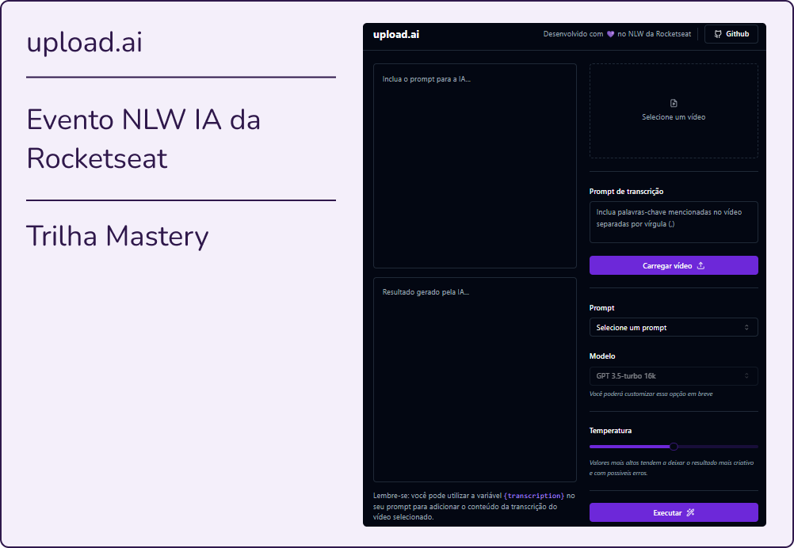

# upload.ai 

Esse projeto foi desenvolvido no evento NLW IA da Rocketseat.

## 💻 Projeto 

O projeto demonstra o uso da inteligência artificial na programação e consiste em fazer o carregamento de um vídeo (arquivo MP4), extrair o áudio deste fazendo a conversão para MP3, fazer com que a inteligência artificial gere uma transcrição e, com base nisso, gere ou um título, ou uma descrição próprios para o YouTube, em conformidade com a escolha do usuário.


## 📸 Preview

<p align="center">
  
</p>


## ✨ Principais Tecnologias 

**Front-end:** React, TailwindCSS

**Back-end:** Node, Fastify, Prisma, OpenAI


## 🛣️ API Endpoints

#### Retorna todos os prompts

```http
  GET /prompts
```

#### Faz o upload do áudio extraído do vídeo

```http
  POST /videos
```

#### Gera a transcrição do áudio

```http
  POST /videos/:id
```

#### Gera a resposta da IA de acordo com o prompt selecionado

```http
  POST /ai/complete
```


## 📝 Licença 

Este projeto está sob a licença MIT. Veja o arquivo [LICENSE](LICENSE.txt) para mais detalhes.

